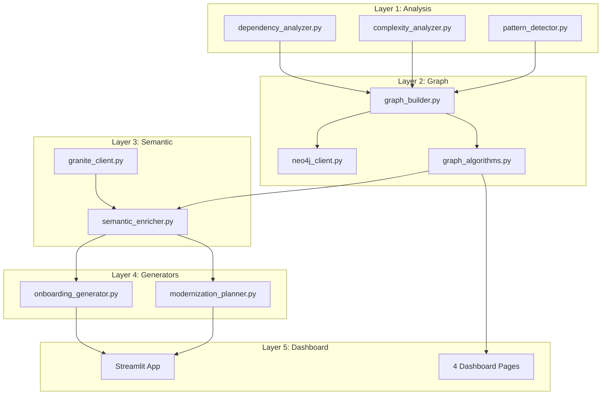

# DevScope Implementation Plan

## Project Overview
DevScope is an intelligent codebase onboarding and modernization tool that combines:
- **Structural Analysis**: Static code analysis for dependencies, complexity, and patterns
- **Knowledge Graph**: Neo4j-based representation of codebase relationships
- **Semantic Enrichment**: IBM Granite LLM for intelligent insights
- **Interactive Dashboard**: Streamlit-based visualization and exploration

## Architecture Diagram



## Data Flow

1. **Input**: User provides repository path
2. **Analysis**: Analyzers scan code structure, dependencies, complexity
3. **Graph Construction**: Results stored in Neo4j knowledge graph
4. **Semantic Enrichment**: Granite LLM adds intelligent insights to nodes
5. **Generation**: Create onboarding docs and modernization plans
6. **Visualization**: Streamlit dashboard displays interactive results

## Implementation Phases

### Phase 1: Foundation (Core Infrastructure)
**Goal**: Set up project structure and core utilities

Files to create:
- `requirements.txt` - All dependencies
- `.env.example` - Configuration template
- `README.md` - Project documentation
- `src/utils/config.py` - Configuration management
- `src/utils/repo_scanner.py` - Repository file scanner

**Key Decisions**:
- Use `python-dotenv` for environment management
- Implement singleton pattern for Neo4j client
- Use async/await for Granite API calls

### Phase 2: Layer 1 - Analyzers
**Goal**: Implement structural code analysis

Files to create:
- `src/analyzers/__init__.py`
- `src/analyzers/dependency_analyzer.py` - Import/dependency tracking
- `src/analyzers/complexity_analyzer.py` - Cyclomatic complexity (radon)
- `src/analyzers/pattern_detector.py` - Design pattern recognition

**Key Features**:
- Parse Python AST for dependency extraction
- Use radon for complexity metrics
- Detect common patterns (Singleton, Factory, etc.)

### Phase 3: Layer 2 - Graph
**Goal**: Build Neo4j knowledge graph

Files to create:
- `src/graph/__init__.py`
- `src/graph/neo4j_client.py` - Neo4j connection singleton
- `src/graph/graph_builder.py` - Convert analysis to graph nodes/edges
- `src/graph/graph_algorithms.py` - PageRank, community detection

**Key Features**:
- Node types: Module, Class, Function, Variable
- Relationship types: IMPORTS, CALLS, CONTAINS, DEPENDS_ON
- Algorithms: Centrality, clustering, path finding

### Phase 4: Layer 3 - Semantic
**Goal**: Enrich graph with LLM insights

Files to create:
- `src/semantic/__init__.py`
- `src/semantic/granite_client.py` - watsonx.ai API wrapper
- `src/semantic/semantic_enricher.py` - Add LLM insights to nodes

**Key Features**:
- Async API calls with retry logic
- Batch processing for efficiency
- Add descriptions, purpose, complexity explanations

### Phase 5: Layer 4 - Generators
**Goal**: Generate documentation and plans

Files to create:
- `src/generators/__init__.py`
- `src/generators/onboarding_generator.py` - Create onboarding guides
- `src/generators/modernization_planner.py` - Suggest refactoring

**Key Features**:
- Markdown output for onboarding docs
- Prioritized modernization recommendations
- Code smell detection and fixes

### Phase 6: Layer 5 - Dashboard
**Goal**: Interactive Streamlit UI

Files to create:
- `src/dashboard/app.py` - Main Streamlit app
- `src/dashboard/pages/01_codebase_xray.py` - Structural overview
- `src/dashboard/pages/02_onboarding_hub.py` - Onboarding docs
- `src/dashboard/pages/03_modernization.py` - Refactoring plans
- `src/dashboard/pages/04_graph_explorer.py` - Interactive graph viz

**Key Features**:
- pyvis for graph visualization
- Metrics dashboard with charts
- Export functionality for docs

### Phase 7: Skills Integration
**Goal**: Add AI-powered analysis skills

Files to create:
- `skills/analyze-codebase.md` - Skill definition for codebase analysis

## Critical Integration Points

### Neo4j Setup
```python
# Connection pattern (singleton)
from src.graph.neo4j_client import Neo4jClient

client = Neo4jClient.get_instance()
# Always check connection before operations
if not client.is_connected():
    client.connect()
```

### Granite API Usage
```python
# Async pattern with retry
from src.semantic.granite_client import GraniteClient

async def enrich_node(node_data):
    client = GraniteClient()
    result = await client.generate_insight(node_data)
    return result
```

### Streamlit Page Ordering
- Pages MUST be numbered: `01_`, `02_`, `03_`, `04_`
- Streamlit automatically orders by filename prefix
- Each page is independent but shares session state

## Non-Obvious Patterns

1. **Unidirectional Layer Flow**: Never import from higher layers
   - ✅ `graph_builder.py` imports from `analyzers/`
   - ❌ `analyzers/` should NOT import from `graph/`

2. **Neo4j Schema Assumptions**: Graph algorithms expect:
   - Node label: `CodeElement`
   - Properties: `name`, `type`, `complexity`, `description`
   - Relationships: `IMPORTS`, `CALLS`, `CONTAINS`

3. **Granite Rate Limits**: 
   - Max 10 requests/second
   - Implement exponential backoff in `granite_client.py`
   - Batch similar requests together

4. **Streamlit State Management**:
   - Use `st.session_state` for cross-page data
   - Initialize state in `app.py` before page navigation

## Testing Strategy

- Unit tests for each analyzer
- Integration tests for graph construction
- Mock Neo4j and Granite API in tests
- Streamlit UI tests using `streamlit.testing`

## Configuration Requirements

`.env` file must contain:
```
NEO4J_URI=bolt://localhost:7687
NEO4J_USER=neo4j
NEO4J_PASSWORD=your_password
WATSONX_API_KEY=your_api_key
WATSONX_PROJECT_ID=your_project_id
```

## Next Steps

1. Review this plan for completeness
2. Switch to Code mode to implement Phase 1
3. Iterate through phases sequentially
4. Test each layer before moving to next